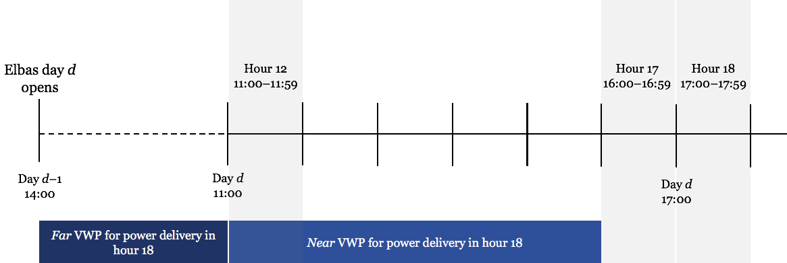
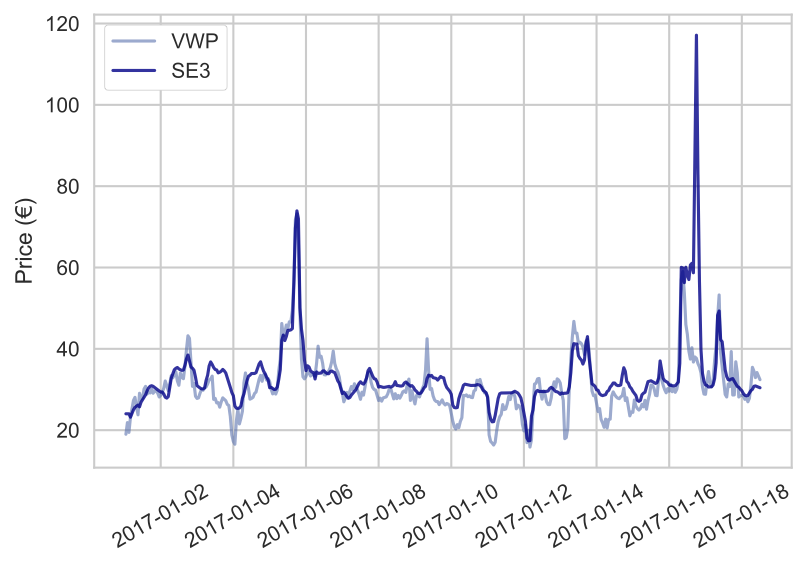
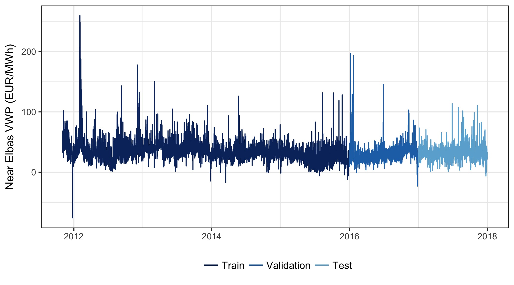
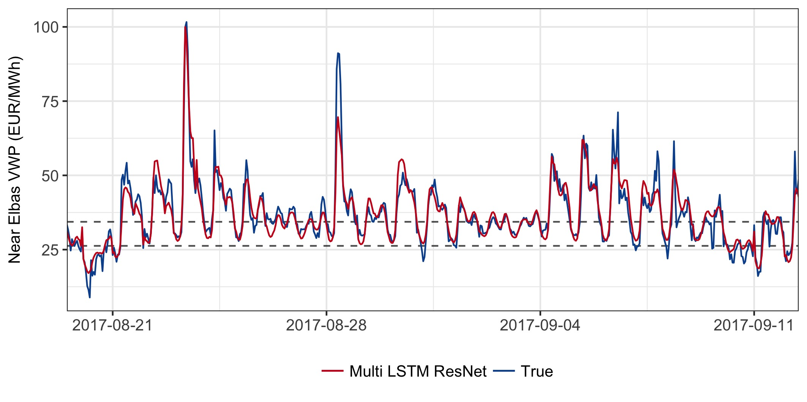
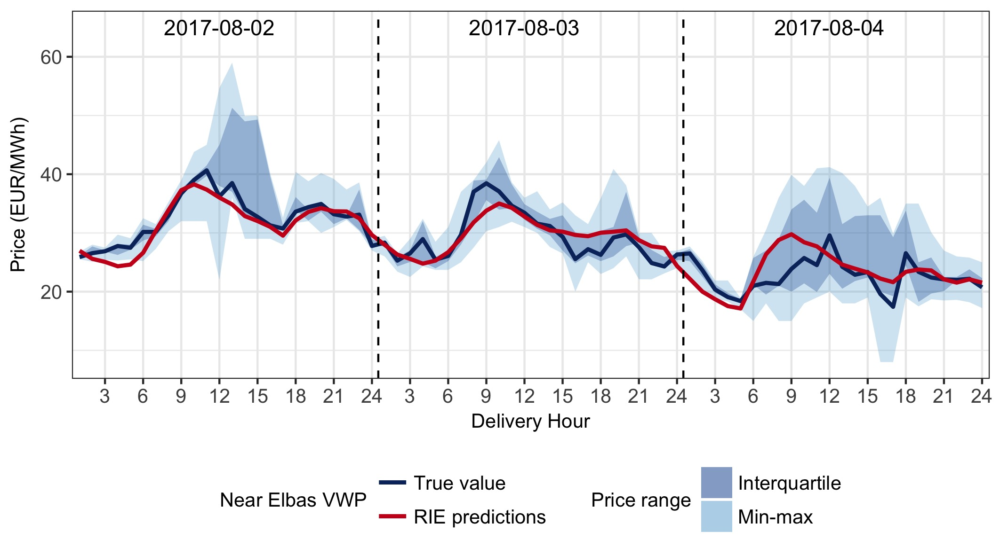

# Thesis Summary
Title: *"Artificial Intelligence and Nord Pool's Intraday Electricity Market Elbas: A Demonstration and Pragmatic Evaluation of Employing Deep Learning for Price Prediction"*  
Authors: *Johannes Kolberg, Kristin Waage*

Thesis project for the MSc in Business Administration and Economics at the Norwegian School of Economics. Written for both decision-makers in the Nordic electricity market that are not necessarily familiar with ML, and for technically inclined readers without a deep understanding of electricity markets.

This is a highly abbreviated version of the thesis. The abstract is included in full, followed by brief summaries, highlights, and salient plots for the problem definition, best simple baseline, data used, final model, and results.

The complete thesis is included in the repository, along with most of the code for data preprocessing and fitting of the final models, as well as numerous plots and illustrations.

The raw data can unfortunately not be shared due to our agreement with the data providers Nord Pool and Montel.

___
## Abstract
This thesis demonstrates the use of deep learning for automating hourly price forecasts in continuous intraday electricity markets, using various types of neural networks on comprehensive sequential market data and cutting-edge image processing networks on spatio-temporal weather forecast maps. Deep learning is a subfield of artificial intelligence that excels on problems such as these with multifarious input data and manifold interacting factors. It has seen tremendous success on a range of problems across industries, and while it is important to have realistic expectations, there is little reason to believe that intraday electricity markets are different. Focusing on Nord Pool’s intraday market Elbas, we predict Nordic buyers’ volume-weighted average price over the last six hours of trading prior to each delivery hour. Aggregating this window gives buyers flexibility from many trades and sufficient time in which to act on the predictions, and solves issues with data sparsity while keeping sufficient resolution for predictions to be informative.

We develop various neural networks via extensive experimentation, with inspiration from other research and problem domains. To make the findings relevant in practice, we impose constraints on the input data based on what would be available to Elbas market participants six trading hours ahead of delivery. The neural networks are benchmarked against a set of simple domain-based heuristics and traditional methods from econometrics and machine learning. We conclude with a holistic evaluation of the efficacy of deep learning on our problem, whether it is economically justifiable in light of its value-add, what the salient hurdles are to implementing it in practice, and what the implications are for broader applications of AI in intraday markets.

The deep learning models are relatively accurate and reliable under normal market conditions. The average price across all delivery hours in the held-out data is €30.95/MWh, where our best network is on average off by €2.72/MWh. It beats the best simple heuristic by 21–25%, and the best benchmark model by 12–16%. The network also anticipates major fluctuations in prices relatively consistently, and generally outperforms all alternative methods when prices are especially volatile or trading activity particularly high. In contrast to the benchmarks, there are also ample avenues for improving the network further. Beyond being promising in its own right, we also argue that the network demonstrates the wider potential of deep learning in a range of applications in intraday markets, and that these are worthy of serious consideration — though one should be aware of the practical hurdles to implementing them operationally.

---
## Problem summary
Electricity markets require constant balance between supply and demand, since the product can only be traded cross-border or stored in economic terms to limited extents. Deregulated exchanges provide multiple trading opportunities to efficiently match supply and demand, and play a crucial role in helping ensure stability in the power system. 

The day-ahead electricity markets are usually auction-based, where power is traded for each consecutive hour of the following day, and are the main arena for trading power. It is a highly complex market with myriad potentially influential variables, and where the relationships between these variables are often non-linear. However, many ML techniques that have become popular in recent years struggle when the data has very high dimensionality. Many such methods also presuppose, either directly or indirectly, the kind of function they should fit to tackle the given problem. Deep learning incorporates more general-purpose assumptions that the data-generating process is a hierarchical composition of factors, and (in theory) automates feature engineering. 

The aim of this thesis is therefore to demonstrate the use of deep learning to forecast hourly prices in the Nordic intraday electricity market, Elbas, using specialised sequential networks on comprehensive market data and image processing on geospatial weather forecast maps. To demonstrate the potential of deep learning under realistic conditions we also incorporate constraints and trade-offs that would exist in practice.

We take the perspective of a Nordic buyer interested in power for a given delivery hour. As Elbas operates continuously, many trading opportunities may arise for each hour of power delivery. Knowing when or if specific trades occur is outside the scope of this thesis, hence we do not predict prices of individual trades. Instead, we predict Nordic buyers’ volume-weighted average price over the last six hours of trading prior to each delivery hour. Intraday trading activity is usually concentrated in the final hours, where our chosen window of six hours is a balance between giving the buyer sufficient time to act on the prediction and mitigating challenges with data sparsity while keeping sufficient detail for predictions to be interesting.

This volume-weighted average price (VWP) over the last six hours before power delivery is the output variable our models are trained to predict. As we predict an aggregate, it is likely some trades for the corresponding hour have already been settled. This information is available to traders, and we engineer a feature that captures the VWP over all hours of trading up to the point where a prediction is made. Dividing into finer intervals resulted in excessive data sparsity and therefore an unrasonable amount of imputation. Hence, we predict the "near" VWP, whereas this additional feature of information on preceding trades is the "far" VWP. 

E.g. the far price for delivery at hour 18 is calculated by aggregating trades settled between when the corresponding Elbas market opened at 14:00 CET the preceding day, and when we make a prediction at the beginning of hour 12. The near price is what our model aims to predict, and represents an aggregate of any trades settled from, and including, hour 12 and when trading closes at the end of hour 16.

## Best simple baseline: SE3 price
A simple baseline would be something like always predicting the mean price from the training set (MAE €6.7 on test), but we can do better with some domain knowledge. One of the predominant bidding areas in the Elbas market is SE3 in Sweden. Always predicting that the VWP will equal the SE3 yields an MAE of €3.43 and RMSE of €5.64 on the test set, which is not trivial to beat:

---
## Data
The dataset consists of almost 2GB of market data supplied by Nord Pool, and over 300GB of weather forecast maps from SMHI supplied by Montel — all of which cover the period from November 2011 to December 2017. Extensive pre-processing is necessary to make them into Numpy arrays for use with Keras, and so that they constitute a complete and consistent timeline.

### Market data
The market data consists of thousands of separate files of differing formats that must be combined into a single dataset with one observation per consecutive hour of power delivery. Typically per hour of power delivery and/or bidding area, these files contain Elbas trade-level price and volume, Elspot buy and sell volumes, transmission capacities, regulating prices, operating data, and tens of thousands of free-text Urgent Market Messages (UMM). For the latter we apply simple NLP to extract important events like demand surges or sudden capacity restrictions as domain experts meant analysts rely heavily on these messages. 

Coercing all of these different file structures into a consistent timeline of hourly data takes considerable wrangling in a mix of R (mostly using *tidyverse*) and Python (via *Numpy* and *Pandas*). The code for doing so is in the repository. Quite extensive preprocessing is necessary. For all the details, please refer to the full thesis.

The resulting market dataset contains 53,400 observations of 328 features, and comprises a continuous timeline with one volume-weighted price per hour of power delivery. Since we aim to build models that capture the temporal structure, we simply split this into three contiguous train, validation, and test sets. Cross-validation or other forms of resampling would yield more robust estimates, but also be more cumbersome to implement while maintaining the temporal structure, and be computationally heavy due to repeated fitting. We instead argue that we have enough data points for a simple three-fold split:

### Weather forecast data
The weather forecast data come as geospatial GRIB files, and must be transformed to constitute a complete timeline of tensors that can be mapped to the market dataset. Each file contains forecasts of five weather properties, or bands, which effectively represent five maps of Europe: temperatures in Kelvin, precipitation, two wind vectors, and surface net solar radiation. Similarly to the RGB channels in colour images, we treat these five bands as five channels of one image, as they cover the exact same geographical area.

The complete set of files is over 300GB, hence we need to limit it considerably. Each raw GRIB file is read into R, where the relevant matrix that comprises each band is separated and extracted, then converted and exported to Python, where a series of steps are performed. In short, the images are cropped, downsampled, interpolated, normalised to [0, 1], and a dedicated Random Forest trained to correct inconsistent band orderings.

The resulting weather dataset is just shy of 6.5GB, which fits into memory alongside the market data on the available hardware. Each forecast’s set of five bands is mapped to corresponding delivery hours so that it can be joined with the market data and, therefore, the associated volume-weighted Elbas prices:

  
*Forecasts of the five bands and the corresponding VWP (€/MWh) at delivery hours in intervals of 36 hours, starting at midnight on November 2, 2011. From the top, each row corresponds to a band: temperature, precipitation, two wind vectors, and solar radiation.*

---
## Deep Learning
The deep learning models are implemented in Keras using the TensorFlow backend, and run on a GTX 980 Ti GPU. Since the best networks beat the benchmarks models (including gradient boosting), the latter are not included in this brief summary.

We used an iterative approach that combines experimentation and inspiration from other research to pursue a more guided path through the space of possible network architectures. To reduce the space of possible architectures we make a set of design choices based on other research and our own empirical experimentation:
* *Loss* function: minimise MAE.
* *Activation functions* (where relevant): ReLU.
* *Mini-batch size*: 128.
* *Optimiser algorithm*: ADAM.
* *Learning rate schedules*: halved when loss plateaus after three or five epochs, depending on the total number of epochs.
* *Regularisation*: heavy use of Dropout. After extensive experimentation, no L1 or L2 to make things simpler.
* *Epochs*: 30 or 100, depending on convergence rate and time to train.

Our experimentation resulted in hundreds of candidate architectures evaluated on the validation set, but only the five most interesting are included in the thesis. Four only use the market data: an LSTM network with two layers, a bidirectional LSTM network (achieved surprising results on time series problems in other research), and two fully-connected feed-forward networks with residual connections and batch normalisation.

For each of our final architectures we use the minimum validation loss (MVL) method to extract the best weights and evaluate the resulting performance, but also use checkpoint ensembling (CE) to try to improve performance further. Each architecture is initialised and run five times, and the median reported for each relevant metric. Since we are fitting each architecture five times anyway, we also perform the equivalent of random initialisation ensembling (RIE) by averaging predictions across the five models using their respective MVL weights.

## Multi-LSTM ResNet
In order to create neural networks that utilise all of the available data, we design an amalgamating multi-input architecture, referred to as the Multi-LSTM ResNet (in lack of a better name), that leverages both the temporal structure of the market data and the spatio-temporal structure of the weather data. Compared to the 328 features per sample of market data, a single five-channel weather forecast image contains 15,125 parameters. Including additional time steps of forecasts is therefore much more computationally costly than with the market data. Since longer windows of market data seem advantageous, particularly with recurrent networks, we design the architecture so that it accepts two different sequence lengths. This architecture consists of three pipes, or distinct sequences of hidden layers: one each for the market and weather data, and one that combines their outputs to process the high-level features and make a final prediction.

Designing such a network is more involved, as we must coerce two different spatio-temporal structures to conform so that they can be used as a combined input. A simple approach is to make a pipe that outputs a set of features without a temporal component. This could be either to flatten each pipe’s output to collapse the temporal dimension — which could erase potentially valuable temporal relationships — or to finish each with a recurrent layer. We have used both approaches when designing networks that only take in market data, but choose to do only the latter when designing the final amalgamating architecture. This is both a result of earlier findings and an educated simplification of the space of possible architectures.

After comprehensive experimentation, we design an amalgamating network architecture that combines recurrent layers to consolidate the temporal dimensions, a time-distributed spatial convolutional pyramid, and a residual network to capture non-linear combinations of the resulting discrete spatio-temporal high level market and weather features:

The top pipe takes in sequences of 7 weather forecast image sets, and consists of a convolutional pyramid with four rounds of time- distributed spatial 3 × 3 convolutions and 2 × 2 max pooling from 32 to 256 filters, followed by an LSTM layer with 64 nodes, and 50% dropout on the activations and recurrent connections. The bottom pipe takes in sequences of 505 hours (21 days) of market data, and consists of two stacked LSTM layers, both with 256 nodes and 50% dropout on the activations and recurrent connections. The two pipes’ outputs are merged via concatenation, and the resulting 320 features processed by a sequence of three residual blocks of respectively 256, 128, and 64 units with respectively 50%, 40%, and 30% dropout. Each consists of three fully-connected layers with ReLU activations. Batch normalisation is applied at the end of each block, followed by adding residual connections, and dropout. The final layer is, as usual, a fully-connected layer with one node and no activation function, which makes the corresponding prediction of volume-weighted price.

### Results

The results of the best simple baseline, best model baseline (from econometrics and more "traditional" ML), and final deep neural network architecture are summarised below:

| Model | MAE (€) | RMSE (€) |
|:------------- |:-------------:|:-----:|
| Simple SE3 baseline | 3.43 | 5.65 |
| Gradient Boosting (trees=1000) | 3.04 | 4.81 |
| Multi-LSTM ResNet (with RIE) | 2.72 | 4.24 |

*Near Elbas VWP predictions from using the Multi LSTM ResNet model (red) compared to the true values (blue), over a three-week period with at times quite volatile prices. The stippled bands mark the lower and upper limit of the test set interquartile range (IQR).*

In terms of performance, the only distinguishing feature of the Multi-LSTM ResNet compared to the simpler LSTM network is faring slightly better in highly irregular periods. That said, we assert that the model with the best potential for predicting the near Elbas VWP is the Multi-LSTM ResNet model, for multiple reasons. Firstly, it is designed to use all available data, including the weather data that we know from literature may have a significant influence on intraday prices. Limited by the available hardware (16GB RAM and 6GB VRAM), we do not include comparable forecasts from the day-ahead market. If included, these may improve the performance of this particular model further. Secondly, the Multi-LSTM ResNet model gains less from ensembling, but still just manages to outperform the other networks, which suggests that if one were to take the time to train more diversified variations it would fare even better. That also makes it more computationally expensive, however.

For more details please refer to the full thesis.
